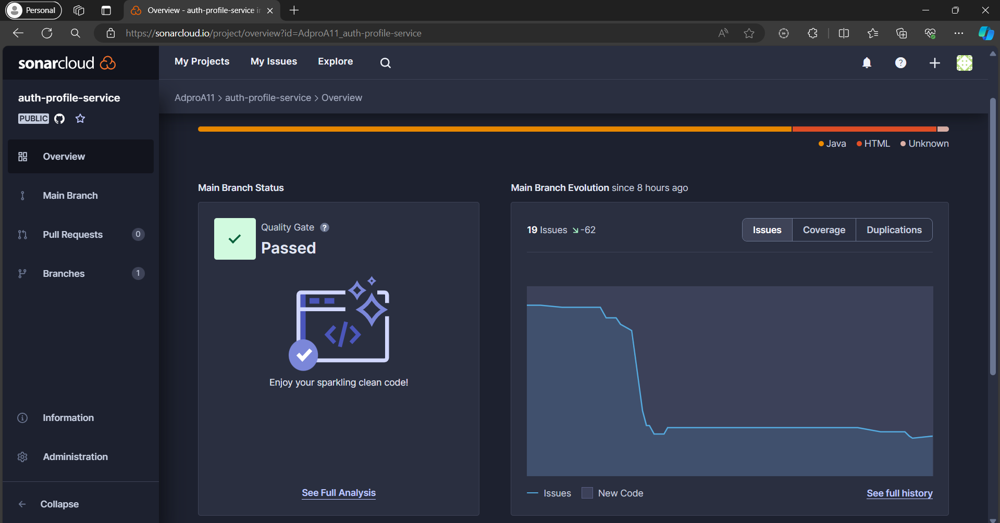
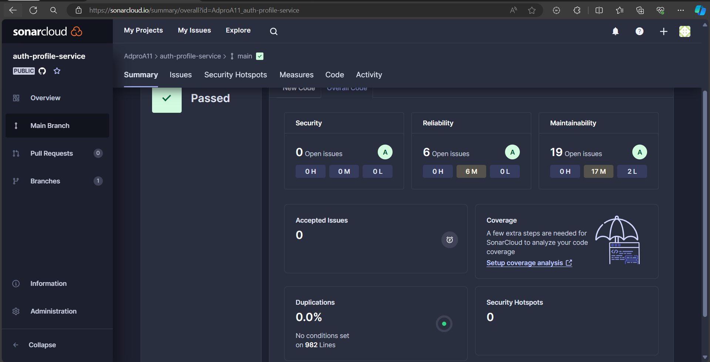
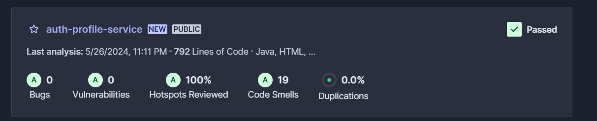
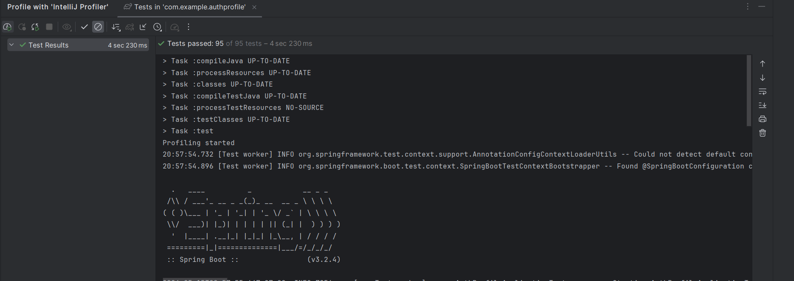

# authentication-profile-service

Darrel Danadyaksa Poli - 2206081995

Clean Code stuffs

# Sonarcloud

Berikut adalah gambar sonarcloud.

Perhatikan bahwa pada awalnya ada 80 issue. Setelah saya perbaiki, issue nya menjadi 19 (ada 76% peningkatan kode). Pada dasarnya yang saya lakukan adalah menghapus unused import serta tidak menggunakan `@Autowired` karena bermasalah dengan safety dan hidden dependency.

Kemudian ini adalah bagian readibility dan maintanibility. Menurut saya sudah cukup baik.

Terakhir, ini adalah overall score saya.

# SOLID

- SRP: JWTGenerator
- OCP: AuthController dapat di extend tanpa modifikasi yang sudah ada
- LSP: Interface AuthenticationManager pada AuthController
- ISP: UserService menyediakan method-method yang diperlukan
- DIP: Pada AuthController, dependency injection dilakukan dengan constructor.

Architecture & Design Pattern

# Design Pattern

- DTO Pattern

# Architecture

- Microservice

Profiling stuffs

Perhatikan bahwa seluruh test sudah pass

